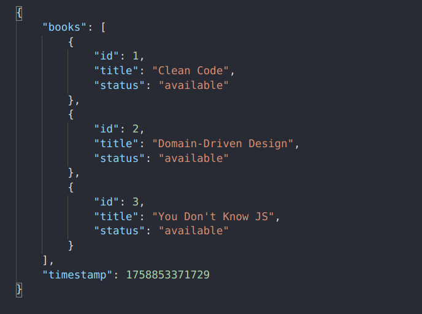
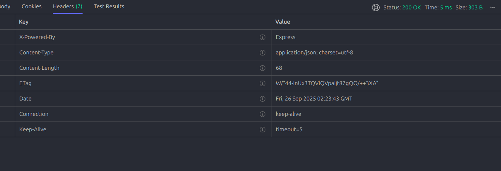

# 📚 Book API với Express + ETag

Đây là một ví dụ nhỏ về cách xây dựng REST API với **Express.js** có hỗ trợ **HTTP caching** bằng `ETag`, `Cache-Control`, và `Last-Modified`.

  
  
  


## 🚀 Chức năng

- `GET /books`  
  Trả về danh sách sách.

  - Hỗ trợ caching với `ETag` (giúp client không cần tải lại dữ liệu nếu chưa thay đổi).
  - Header `Cache-Control: public, max-age=600` cho phép cache 10 phút.
  - Nếu client gửi `If-None-Match` và `ETag` khớp → server trả `304 Not Modified`.

- `POST /books/:id/borrow`  
  Mượn một cuốn sách theo ID.
  - Nếu sách đã bị mượn → trả lỗi `400`.
  - Nếu ID không tồn tại → trả lỗi `404`.
  - Nếu thành công → trả về thông tin sách với `status: "borrowed"`.
  - Sau khi dữ liệu thay đổi, `ETag` của `/books` cũng sẽ thay đổi.

---

## 🛠️ Cài đặt & chạy

### 1. Cài dependencies

```bash
npm install
```

### 2. Chạy server

```bash
node Week3/server.js
```

Server sẽ chạy tại:

```
http://localhost:3000
```

---

## 📡 Ví dụ sử dụng

### Lấy danh sách sách

```bash
curl -i http://localhost:3000/books
```

Lần đầu sẽ trả về `200 OK` + dữ liệu JSON + headers:

```
Cache-Control: public, max-age=600
ETag: "a1b2c3..."
Last-Modified: Fri, 27 Sep 2025 07:00:00 GMT
```

### Sử dụng cache với `ETag`

```bash
curl -i http://localhost:3000/books -H 'If-None-Match: "a1b2c3..."'
```

Nếu dữ liệu chưa thay đổi → server trả về:

```
HTTP/1.1 304 Not Modified
```

### Mượn sách (id=1)

```bash
curl -X POST http://localhost:3000/books/1/borrow
```

Kết quả:

```json
{
  "ok": true,
  "book": {
    "id": 1,
    "title": "Clean Code",
    "status": "borrowed"
  }
}
```

---

## 📖 Ghi chú

- `Cache-Control: max-age=600` cho phép cache tối đa 10 phút.

  - Có thể thay đổi thành `no-cache` để buộc client luôn xác thực lại với server trước khi dùng cache.

- `ETag` được tính toán từ nội dung `books` → thay đổi dữ liệu thì `ETag` cũng đổi theo.
